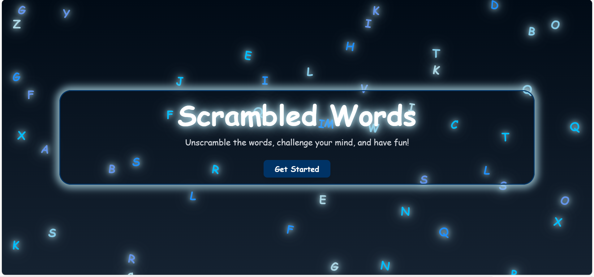
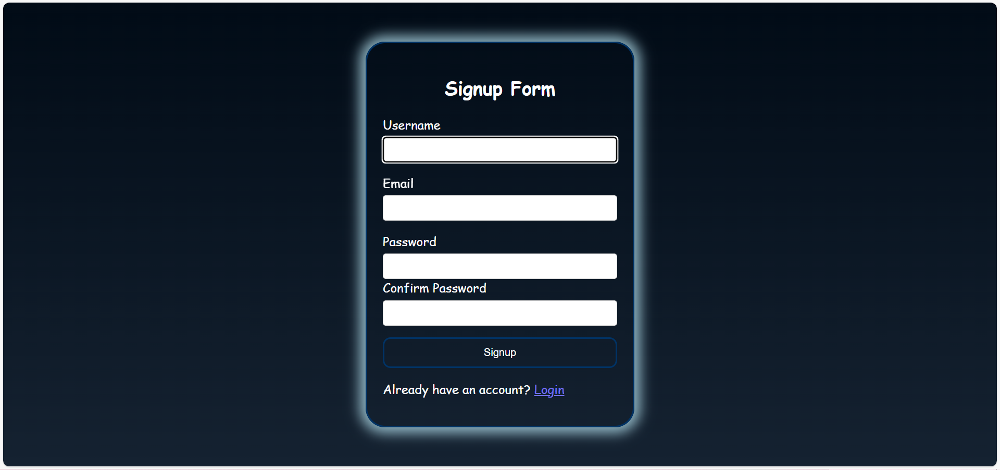
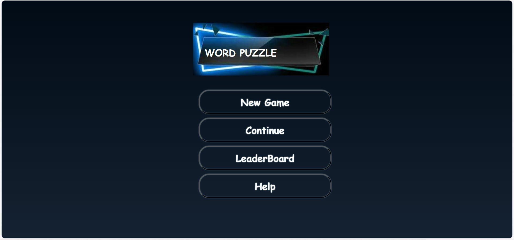
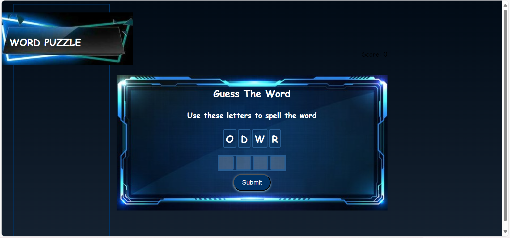

## Scrambled Words Game
- This is a multiplayer game where players compete by solving the scrambled words puzzle.
# Tools used
- HTML, CSS, Javascript for the frontend
- Golang for the backend
- Database: mongodb, Redis
# Features
- Authentication
- Multiplayer support
- A websocket to broadcast winners 
- A leaderboard that displays list of top players in real time.
- Updates the list online players and their scores in realtime.
- The game is distributed across multiple servers to ensure fault tolerance
# Screens

  
